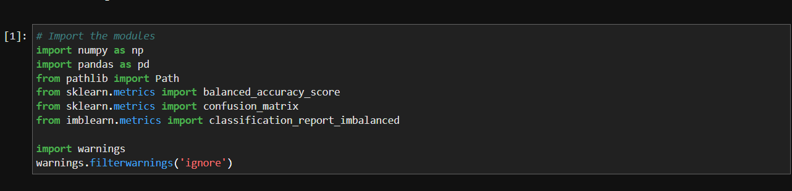
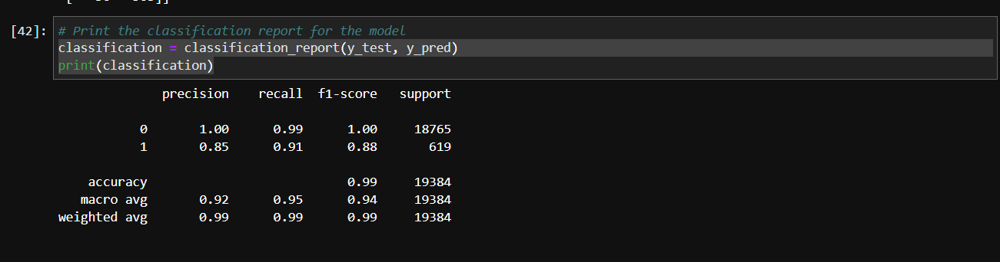
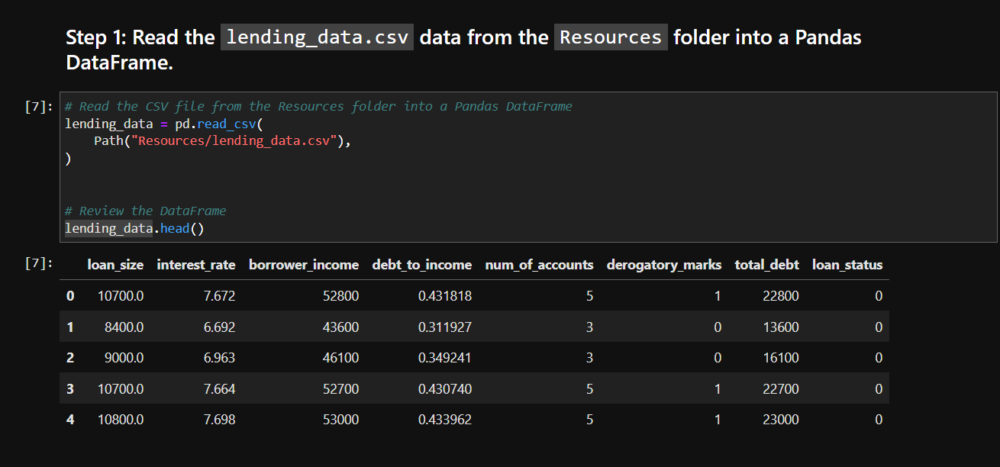
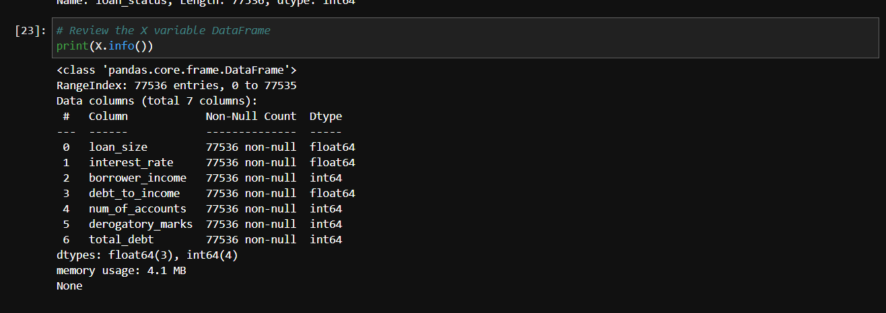
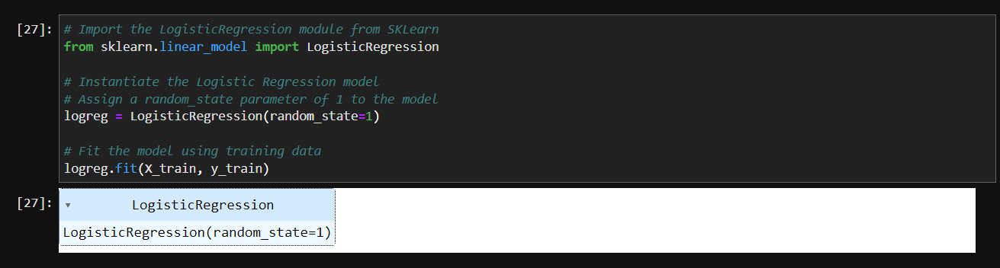

# Module_12_Challenge
# Credit Risk Classification

Hello, this project is about the Credit Risk Classification. Credit risk classification is the the process of assessing the creditworthiness of borrowers or potential borrowers to determine the likelihood of defaulting on their credit obligations. It involves analyzing various factors and indicators to evaluate the risk associated with extending credit to individuals or businesses.

---

## Technologies

pandas is a software library written for the Python programming language for data manipulation and analysis. In particular, Credit risk classification models typically utilize historical data, financial information, credit scores, and other relevant factors to predict the probability of default or the likelihood of timely repayment. These models employ various techniques such as statistical analysis, machine learning algorithms, and data mining to identify patterns and relationships that can assist in making accurate credit risk assessments.
---

## Installation Guide

Import the correct packages to begin coding.

---

## Usage

Use Plots and data frame to get the correct portfolio

---

## Contributors

-Name: John Nguyen
-Email: nguyenjohn1337@gmail.com

---

## License

Specify the details of your project’s license - that is, how others can or cannot use your code and files.
